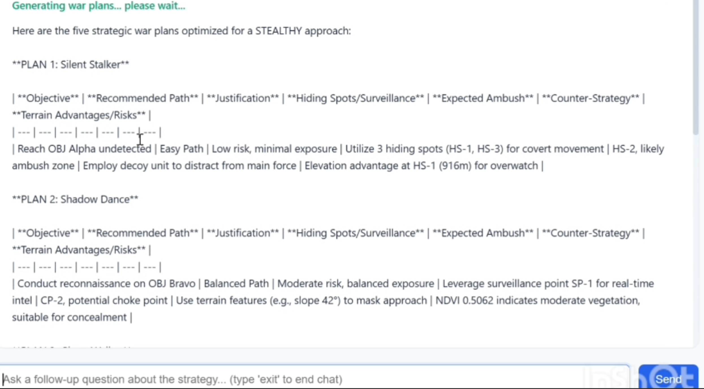
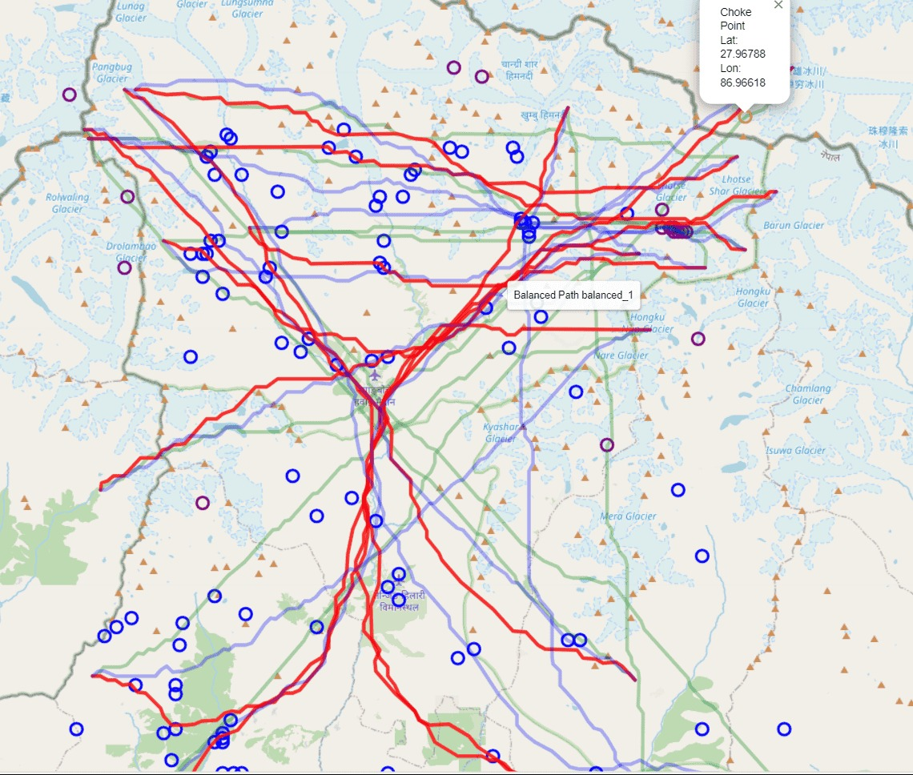

# 🌍 TerraIntel

**TerraIntel** is a strategic geospatial intelligence system built to generate terrain-optimized stealth mission plans. It combines satellite data, AI-driven pathfinding, and terrain analysis to create operational strategies for reconnaissance and mission planning.

---

## 🧠 Project Demo

Here’s an example of TerraIntel generating stealth-optimized mission plans:



Each plan includes:
- Objective & path
- Justification of route
- Surveillance/hiding spot utilization
- Terrain advantages, ambush points, and countermeasures

---

## 🗺️ Terrain Path Mapping

Visual representation of terrain analysis with marked surveillance points, hiding spots, and computed strategic paths:



---

## 📌 Key Features

- 📡 **Tactical War Plan Generation**  
  Creates multiple strategic plans based on terrain intel and stealth parameters.

- 🧭 **AI-Driven Path Optimization**  
  Recommends routes based on choke points, slope angles, vegetation, and elevation data.

- 🔍 **Surveillance & Risk Estimation**  
  Identifies hiding spots, ambush zones, and counter-strategy options with calculated terrain risk.

- 🧾 **Readable Operational Briefs**  
  Each strategy is exported in a clear, mission-brief format for tactical teams.

---

## 🛠️ Tech Stack

- **Python** – Core engine  
- **Rasterio** – Image analysis for map features  
- **Pandas & NumPy** – Terrain data processing  
- **Matplotlib** – Visualization  
- **Custom Algorithms** – For slope, elevation, and vegetation-based risk scoring

---

## 🚀 How to Run

1. Clone the repository
```bash
git clone https://github.com/yourusername/terraintel.git
cd terraintel
pip install -r requirements.txt
python run_all.py
